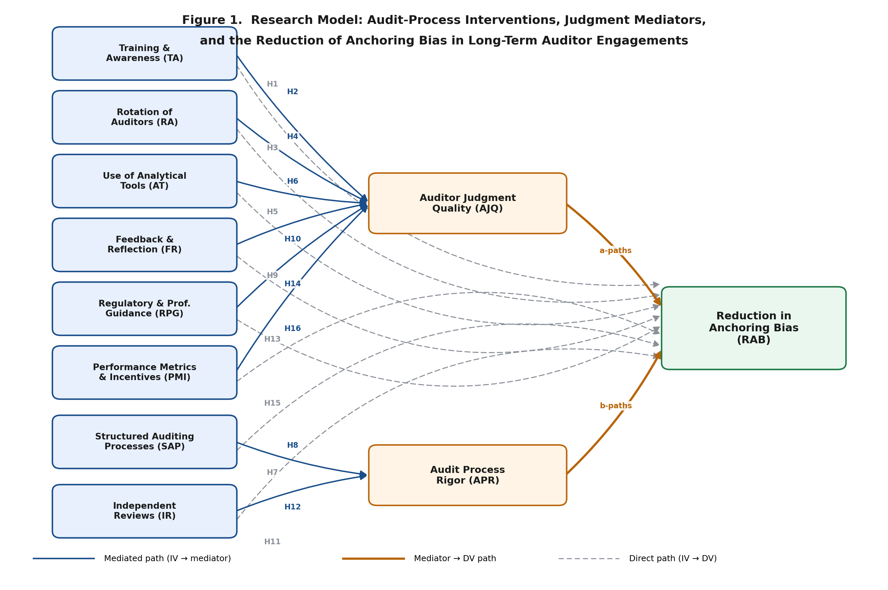

<div align="center">

# Mitigating Anchoring Bias in Long-Term Auditor Engagements
### An EFA-Based Validation Study


**Yasir A. Malik** · PID [PID redacted] · FIU DBA Cohort 7.16
GEB7913 · Advisor **Prof. Dr. Juan Rey** · IRB **IRB-25-0462**

</div>

---

> **The study.** Which audit-process interventions most effectively reduce **anchoring bias** in long-term (multi-year) auditor engagements? Eleven constructs and a sixteen-hypothesis model (proposed framework). **For this summer project, the analysis validates the measurement model via exploratory factor analysis and reliability** on a target of **n = 100 valid** audit-professional responses; hypothesis and mediation testing are future research (per advisor directive, 2026-06-30).

<div align="center">



*Figure 1 — Eight interventions → two mediators → reduction in anchoring bias.*

</div>

---

## ⭐ Start here

| Open this | What it is |
|---|---|
| 📊 [`PROGRESS_TRACKER.md`](PROGRESS_TRACKER.md) | **Live status + dated path to the manuscript** — read this first |
| 📝 [`Full_Survey_Questionnaire_v2.docx`](Full_Survey_Questionnaire_v2.docx) | The instrument (v2.1, post peer review) |
| 📄 [`Research_Paper_YMalik_v4.docx`](Research_Paper_YMalik_v4.docx) | Full paper — Ch. 1–3, model, hypotheses |
| 🗺️ [`DBA_Master_Action_Pack.pdf`](DBA_Master_Action_Pack.pdf) | Week-by-week action plan |

**🛰️ Governance Console (live dashboard):** https://claude.ai/code/artifact/88e88dae-8818-48dc-9bab-263774af0d93
**🔗 Live survey:** https://fiu.qualtrics.com/jfe/form/SV_3lae5xJsPcRfIN0

---

## 📍 Status snapshot

| Piece | State |
|---|---|
| Survey built + published in Qualtrics (73 items) | ✅ **LIVE** |
| Verified end-to-end on mobile | ✅ |
| Peer review ×2 (wording + methodology) → v2.1 | ✅ Incorporated |
| Analysis directive locked (EFA + reliabilities, n=100, PAF + Direct Oblimin) | ✅ |
| EFA + reliability playbook (from advisor's assignment) | ✅ Built |
| **Data collection** | 🟢 **Live — 12 valid responses to date** |
| Recruiting platform | 🔵 **Prolific (primary, launching)** · Managed research (backup) |
| n = 100 → EFA → manuscript | 🔜 Jul 9–10 → Jul 19 |

---

## 🗓️ Timeline

| When | Milestone | Status |
|---|---|---|
| Jul 1 | Survey LIVE · data collection begins | ✅ |
| Jul 2–3 | Prolific launch · finalize consent + redirect · fund | 🔵 active |
| Jul 3–9 | Scale to **n = 100 valid** | ⬜ |
| Jul 10 | Clean data | ⬜ |
| Jul 10–14 | **EFA + reliabilities** (PAF + Direct Oblimin) | ⬜ |
| Jul 14–17 | Write Data Analysis + results | ⬜ |
| **Jul 18–19** | Submit final manuscript | 🎯 |

---

## 📐 The instrument

11 constructs × 5 items = **55 construct items**, + 2 attention checks, 5 screeners, a context control, an open item, and demographics → **74 respondent-facing items**. 5-point Likert (decision documented vs 7-point).

| File | Purpose |
|---|---|
| [`Full_Survey_Questionnaire_v2.md`](Full_Survey_Questionnaire_v2.md) | Reviewed instrument (v2.1) + change log |
| [`Qualtrics_Survey_Import.txt`](Qualtrics_Survey_Import.txt) | One-click Qualtrics import (Advanced Format) |
| [`Qualtrics_Codebook_and_Setup.md`](Qualtrics_Codebook_and_Setup.md) | Reverse-code map + 7-step post-import setup |

## 🔍 Peer review → [`04_Peer_Review/`](04_Peer_Review)

| File | Purpose |
|---|---|
| [`Note_and_Responses_to_Richard_2026-06-21.docx`](04_Peer_Review/Note_and_Responses_to_Richard_2026-06-21.docx) | Reviewer-facing "you flagged → we did → why" |
| [`Peer_Review_Response_Richard_2026-06-21.docx`](04_Peer_Review/Peer_Review_Response_Richard_2026-06-21.docx) | Formal point-by-point response |
| [`Methodological_Limitations_and_Remedies.md`](Methodological_Limitations_and_Remedies.md) | Pre-empts review #2 (CMB, discriminant validity, self-report) — Podsakoff 2003 + Fornell-Larcker 1981 |

## 🚀 Recruitment & launch → [`03_Recruitment_and_Pilot/`](03_Recruitment_and_Pilot)

| File | Purpose |
|---|---|
| [`LIVE_Survey_Status.md`](LIVE_Survey_Status.md) | Live link + before-launch checklist |
| [`CloudResearch_Setup_Guide.docx`](CloudResearch_Setup_Guide.docx) | 8-step launch (primary recruiting route) |
| [`Informed_Pilot_Run_Plan.docx`](Informed_Pilot_Run_Plan.docx) | Pilot (6–10 auditors) + 6 decision gates |

## 📨 Advisor & meeting → [`correspondence/`](correspondence)

| File | Purpose |
|---|---|
| [`2026-06-30_Rey_meeting_July2_request.md`](correspondence/2026-06-30_Rey_meeting_July2_request.md) | July 2 meeting email + agenda |
| [`Milestones_and_Timeline.md`](Milestones_and_Timeline.md) | 12 milestones with gates |

---

## 📊 Methods at a glance

- **Sample:** **n = 100 valid** US audit professionals via CloudResearch (MTurk backup).
- **Analysis (this project):** EFA — **Principal Axis Factoring + Direct Oblimin rotation**, KMO + Bartlett + parallel analysis; reliability (Cronbach's α). *No mediation/hypothesis testing this term (advisor directive); model + hypotheses are the proposed framework / future research.*
- **Item rule:** remove loadings < .30; decide .30–.40 case-by-case (keep if removal worsens the pattern matrix).
- **Theory lens:** dual-process theory via the anchoring-and-adjustment heuristic.
- **Rigor remedies:** anonymity, reverse items, block randomization, attention checks; planned Harman's test + marker variable for common method bias.

---

## 🗂️ Repository map

```
dba/
├── README.md                              ← you are here
├── PROGRESS_TRACKER.md                    ← live status (start here)
├── LIVE_Survey_Status.md                  ← live link + launch checklist
├── Research_Paper_YMalik_v4.docx          ← full paper
├── Anchoring_Bias_Research_Model.png      ← Figure 1
├── Full_Survey_Questionnaire_v2.*         ← instrument v2.1
├── Qualtrics_Survey_Import.txt            ← one-click build
├── Qualtrics_Codebook_and_Setup.md
├── Methodological_Limitations_and_Remedies.*  ← pre-empts review #2
├── CloudResearch_Setup_Guide.*
├── Informed_Pilot_Run_Plan.*
├── Milestones_and_Timeline.*
├── DBA_Master_Action_Pack.pdf
├── 03_Recruitment_and_Pilot/              ← pilot + recruiting packet
├── 04_Peer_Review/                        ← both peer reviews + responses
└── correspondence/                        ← advisor updates & meeting
```

---

<div align="center">

### Boundaries held
No AI/LLM items in this survey (future extension) · No employer / client / engagement-level / sensitive data · Wording-and-flow-only revisions during pilot; scope changes escalate to advisor + IRB.

<sub>Branch <code>claude/scholar-links-review-Plgk6</code> · Updated Jul 1, 2026</sub>

</div>
