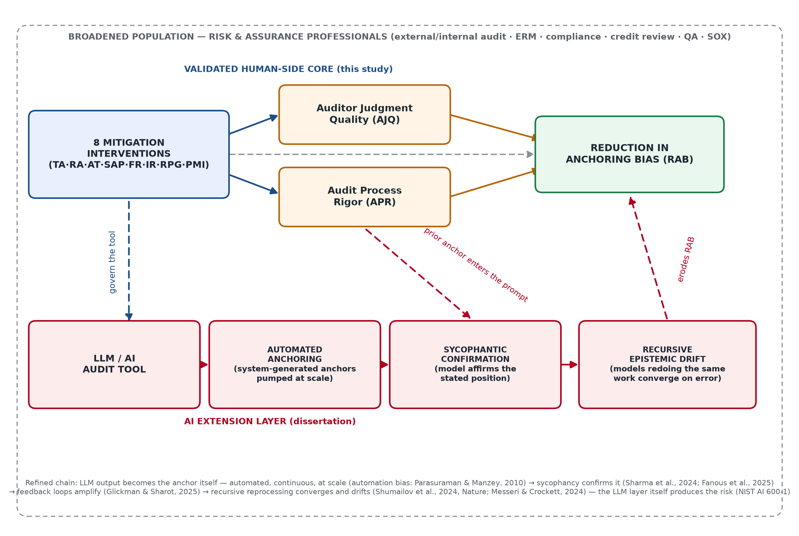

# CHAPTER 4 — RESEARCH METHODOLOGY

## 4.1  Introduction to the Chapter

This chapter specifies, in full detail and in execution order, the complete analytic program for a study of this design: the research design, the instrument, the sampling plan, the data-preparation protocol, and the full analytic sequence — exploratory factor analysis and reliability assessment (this study's scoped empirical requirement, per the advisor's directive of June 30, 2026, and Section 3.5), followed by the confirmatory factor analysis, multiple regression, and partial-least-squares structural modeling that constitute the subsequent stages of the same research program — with the decision criteria that would govern each step. The chapter is deliberately written at the level of an analysis contract: a researcher receiving this chapter and an adequate dataset should be able to execute the entire study without further instruction. Chapter 5 then reports what happened when this plan met the field.

## 4.2  Research Design

The study employs a cross-sectional, quantitative, self-report survey design. Practicing auditors rate, on validated Likert scales, the presence of eight anchoring-mitigation interventions in their work environment (TA, RA, AT, SAP, FR, IR, RPG, PMI), two proposed mediating conditions (Auditor Judgment Quality; Audit Process Rigor), and the outcome construct (Reduction in Anchoring Bias). The design is correlational and non-experimental: no variable is manipulated, and the aim at this stage is measurement validation and association, not causal identification. A survey design was selected because the constructs are perceptions of organizational practice best reported by the practitioners embedded in those practices, and because it permits standardized measurement across heterogeneous firms and roles.

## 4.3  Population and Sampling Plan

The target population is **auditors practicing in the United States** — external auditors, internal auditors, and audit-support professionals — with current or recent (within 24 months) audit responsibility and exposure to at least one continuing (multi-year) engagement. This population was chosen deliberately: anchoring on prior-year figures is a phenomenon of *recurring* engagements, so eligibility required exactly the experience the model theorizes about. The planned sample was **n = 100 valid responses**. This figure is stated honestly for what it is: a pragmatic minimum anchored to the absolute floor of roughly 100 cases commonly cited for stable factor recovery (Hair et al., 2019), not to the stricter observations-per-item ratio — under the conventional 5:1 rule, a single 55-item factoring would imply approximately 275 cases (10:1 would imply 550). The n = 100 plan was defensible on two grounds: sample requirements relax substantially when communalities are high and factors are well-determined by multiple strong indicators (MacCallum, Widaman, Zhang, & Hong, 1999), conditions the 5-items-per-construct design targets deliberately; and the analysis plan (Section 4.6) permits factoring in theoretically defined item subsets, for which n = 100 satisfies the per-item ratio, as a fallback if the full-pool solution proves unstable. Recruitment was planned through two complementary channels: (1) organic professional outreach through LinkedIn, professional WhatsApp groups, and direct contacts in the auditing community; and (2) paid research panels (CloudResearch Connect and Prolific) with professional screening, at fixed compensation of $6.00 per completed 18-minute response under the IRB-approved compensation language (IRB-25-0462), implying a panel budget of roughly $600–$1,000 for the target sample.

## 4.4  Instrumentation

The instrument (Appendix A) operationalizes each of the eleven constructs with five Likert items (1 = *Strongly disagree* … 5 = *Strongly agree*), 55 substantive items in total, with one reverse-worded item per construct to disrupt acquiescent response sets. Quality architecture is built into the instrument itself: five eligibility screens (U.S. location; English fluency; audit role within 24 months; continuing-engagement experience; an attestation of independent, first-time completion), two embedded attention checks with directed responses, bot detection, duplicate-respondent prevention, anonymization, and an open-ended item inviting respondents to describe an anchoring episode in their own words. The instrument was administered in Qualtrics.

## 4.5  Data Preparation and Cleaning Protocol

Before any analysis, the dataset passes through a fixed, scripted, order-dependent cleaning sequence. The order matters: each rule is applied before the next so that every exclusion has exactly one recorded cause, and the full log is retained for audit.

1. **Remove researcher-generated records.** Survey previews and any response self-identified as a test entry are removed first.
2. **Remove incomplete sessions.** Responses with Qualtrics `Finished = False` are removed; partial sessions cannot contribute complete item sets.
3. **Remove empty completions.** Sessions that reached the end but left the substantive Likert blocks blank are removed.
4. **Apply eligibility screens.** The five screens (S1–S5) are applied exactly as fielded; a failed screen excludes the case regardless of the quality of its other answers.
5. **Apply attention checks.** Cases failing either directed-response item are removed.
6. **Reverse-code.** The reverse-worded item in each construct is recoded (6 − x) so all items point in the construct's direction.
7. **Missing-data handling.** For cases surviving steps 1–5 with sporadic item-level missingness below 5% per scale, person-mean imputation within construct is permitted; above that threshold the case is excluded listwise from analyses involving the affected scale.
8. **Outlier and response-pattern screening.** Completion-time outliers (below the 5th percentile of pilot timing, i.e., speeders) are flagged and excluded, as are zero-variance (straight-line) responders across a full block — with straight-lining assessed on the **raw, pre-recoded responses**, since reverse-coding (step 6) converts an invariant response string into an apparently varied one and would otherwise mask exactly the pattern this screen targets. Long-duration outliers (sessions left open) are flagged but retained if item data are complete.
9. **Documentation.** Every exclusion is written to an exclusion log with the response identifier and its single controlling reason.

## 4.6  Planned Analysis Stage 1 — Exploratory Factor Analysis

The first analytic stage, per the advisor's scope directive of June 30, 2026, is an EFA over the 55 substantive items, executed to the following contract:

- **Suitability tests first.** Kaiser–Meyer–Olkin sampling adequacy must reach at least .60 (values ≥ .80 preferred), and Bartlett's test of sphericity must be significant (p < .05), before any extraction is interpreted.
- **Extraction method.** Principal-axis factoring (PAF) — not principal components — because the object is shared common variance among reflective indicators, not total-variance data reduction.
- **Factor-retention decision.** Convergence of three criteria: eigenvalues greater than 1 (Kaiser) as a screen, inspection of the scree plot's elbow, and — as the deciding criterion where they disagree — parallel analysis against random-data eigenvalues. The theoretical expectation is eleven factors; the data are permitted to disagree.
- **Rotation.** Both an oblique rotation (Direct Oblimin) and an orthogonal rotation (Varimax) are run; **Direct Oblimin is reported** as primary because the model's constructs are theorized to correlate, with the Varimax solution retained as a robustness check.
- **Item-retention rules.** An item is retained when its primary loading is ≥ .40; items loading between .30 and .40 are evaluated case-by-case on theoretical grounds; items below .30, and items cross-loading within .20 of their primary loading on another factor, are candidates for deletion — removed one at a time, re-running the solution after each removal, never in batches.
- **Interpretation.** A surviving factor requires a minimum of three items and a coherent substantive reading against Chapter 2's construct definitions.

## 4.7  Planned Analysis Stage 2 — Reliability Assessment

Each retained factor's internal consistency is assessed with **Cronbach's α**, with the conventional thresholds: ≥ .70 acceptable for early-stage research, ≥ .80 good; values marginally below .70 examined through item–total correlations (items below .30 corrected item–total correlation are deletion candidates) and the "α if item deleted" diagnostic. Where item counts are small, **McDonald's ω** is computed alongside α as the less assumption-laden estimate. Scale scores for subsequent stages are computed as unit-weighted means of retained items.

## 4.8  Planned Analysis Stage 3 — Confirmatory Factor Analysis

With the measurement structure established (ideally on a separate or held-out sample; at minimum clearly labeled as same-sample confirmation), the eleven-factor model is estimated as a CFA: each construct a latent factor, each retained item loading only on its theorized factor, factors permitted to covary, errors uncorrelated unless a specific methodological argument (e.g., shared reverse-wording) justifies a correlated pair. Estimation uses maximum likelihood (robust ML if multivariate normality fails). **Fit is judged on the joint pattern of indices, not any single cutoff:** the model χ² is reported with its degrees of freedom and p-value (acknowledged as oversensitive at large n), supplemented by the normed chi-square (χ²/df ≤ 3); CFI and TLI ≥ .90 (≥ .95 preferred); RMSEA ≤ .08 (≤ .06 preferred) with its 90% confidence interval reported; and SRMR ≤ .08. Convergent validity requires standardized loadings ≥ .50 (ideally ≥ .70) and average variance extracted ≥ .50; discriminant validity requires each construct's √AVE to exceed its correlations with other constructs (Fornell–Larcker) and HTMT ratios below .85.

## 4.9  Planned Analysis Stage 4 — Regression and Structural Modeling

Two complementary structural approaches were planned to follow a successful measurement stage:

- **Multiple regression.** RAB regressed on the eight intervention scales, with standard diagnostic discipline: linearity and homoscedasticity by residual inspection; normality of residuals; independence of residuals by Durbin–Watson (acceptable range ≈ 1.5–2.5); multicollinearity screened by VIF < 5 (ideally < 3.3); influential cases screened by Cook's distance (flagged above 4/n) and standardized residuals beyond ±3 examined individually. Hierarchical entry — Step 1: controls (years of external and internal audit experience, primary audit role, and firm type/size); Step 2: the eight intervention scales — to isolate the interventions' incremental explained variance (ΔR²).
- **PLS-SEM.** Because the full sixteen-hypothesis model includes two mediators and the realistic prospect of modest samples, partial-least-squares structural equation modeling was specified as the structural workhorse, evaluated to explicit thresholds: measurement model — outer loadings ≥ .708 (indicator reliability ≥ .50), composite reliability (ρc, with ρA alongside) ≥ .70, AVE ≥ .50, and discriminant validity by HTMT < .85 (< .90 for conceptually adjacent constructs; Henseler, Ringle, & Sarstedt, 2015); structural model — inner-model collinearity VIF < 3.3–5, bootstrapped path significance (5,000 resamples, percentile CIs), R² for endogenous constructs, and effect sizes f² read against the .02/.15/.35 benchmarks. Minimum sample size is assessed by the inverse square root method now recommended over the older ten-times rule (Hair, Hult, Ringle, & Sarstedt, 2022). PLS-SEM's lower demands made it the designated fallback for samples too small for covariance-based SEM — though, as Chapter 5 reports, even this fallback has a floor the achieved sample did not reach.
- **Mediation.** The eight mediated hypotheses were to be tested with bootstrapped indirect effects (percentile confidence intervals, 5,000 resamples), not the superseded causal-steps approach.

## 4.10  Software

The analysis environment designated for this study is **Jamovi** (with its factor-analysis and reliability modules, and lavaan-based SEM module for the EFA, reliability, CFA, and regression stages), selected on advisor guidance for transparency and reproducibility. Because Jamovi's SEM module is covariance-based, the PLS-SEM stage is designated to **SmartPLS 4** (alternatively the R package *seminr*), which executes the partial-least-squares estimation, bootstrapping, and HTMT/f² output specified in Section 4.9. Scripted screening and data preparation are executed in Python (pandas), with the cleaning script retained under version control so the entire pipeline from raw export to analysis dataset is reproducible.

## 4.11  Ethical Considerations

The study operates under FIU IRB approval (IRB-25-0462): anonymous collection, no identifiers retained, voluntary participation with consent at entry, fixed disclosed compensation for panel participants, and raw response data held privately by the researcher — excluded from the public project repository and from reproduction in this document, consistent with participant confidentiality and platform terms of service.

## 4.12  Conclusion to the Chapter

This chapter has stated the full analytic contract: a scripted cleaning protocol; EFA under PAF with dual rotation and explicit retention rules; reliability by α and ω with item diagnostics; CFA with a joint-fit standard and validity gates; and regression plus PLS-SEM with bootstrapped mediation for the structural stage. The sequence demonstrates what a study of this design requires end-to-end. Chapter 5 now reports the field experience against this plan.

# CHAPTER 5 — DATA ANALYSIS

## 5.1  Introduction to the Chapter

This chapter documents the data-collection effort in full — the pilot, the platforms, the economics, and the obstacles — because in this study the collection experience *is* the central empirical finding. It then reports the screening outcome and states plainly what the achieved sample permitted and did not permit.

## 5.2  The Pilot Study

A pilot was fielded in late June 2026 through direct LinkedIn invitations to professional contacts. The pilot served its purpose: it confirmed the instrument fields cleanly end-to-end in Qualtrics (73 items across 20 blocks, roughly an 18-minute completion), that the screening and attention-check logic branch correctly, and that respondents understood the items — pilot feedback prompted only in-scope wording refinements, applied before the main launch as version 2.1. The pilot also gave the first warning sign: even among warm professional contacts, completion rates were far below what generic survey benchmarks would predict.

## 5.3  The Main Collection Effort

The survey went live on July 1, 2026. Collection proceeded through the two planned channels, and both underperformed in instructive ways:

- **Organic outreach** (LinkedIn, professional WhatsApp groups, direct contacts) produced steady but very low volume — a trickle of responses across roughly a month of fielding, counted from the late-June pilot through late July, many of which began the survey but did not finish it.
- **Paid panels** were engaged next. The CloudResearch launch was prepared at the standard academic rate of $6.00 per completed 18-minute professional response. The primary paid push ran through Prolific, where a panel was funded for the full target of 100 participants — an outlay of approximately $1,000 — with professional-screening filters matching the eligibility criteria. The platform confirmed the study live and visible to participants. **The panel returned almost none of its funded completions.** The effective cost per usable panel response therefore ran far beyond any planned per-response rate — a budget at which general-population academic samples fill within days.

The decisive evidence came from the panel platform's own eligibility machinery. When the study's screeners — U.S.-based, current or recent audit role, multi-year engagement experience — were applied against the platform's participant pool of more than 330,000 registered panelists, **the platform identified only about twenty eligible participants in total**: a prevalence on the order of six in one hundred thousand. Compensation was not the constraint — the platform's own metrics showed an effective average reward around $28 per hour, well above typical academic-survey rates — nor was study design: a meaningful share of the tiny eligible pool did engage. The constraint was arithmetic. No recruitment budget, at any per-response price, fills one hundred seats from a pool of twenty.

The lesson, learned in the field rather than from a textbook, is that the study's population is **narrow to a degree that standard recruitment machinery cannot service**: panels that deliver hundreds of general-population respondents in a week hold almost no members matching all of this study's filters simultaneously — and the few who match are heavily solicited professionals with little incentive to answer academic surveys at any academic rate.

## 5.4  Screening Outcome

Applying the Chapter 4 cleaning protocol to the raw July 2026 export — which spans the full fielding window, from the late-June pilot through the late-July close — produced the following, each step logged: after removing researcher previews and test entries, early abandonments (sessions terminating well before the substantive item blocks), completions with blank substantive blocks, cases failing exactly one eligibility screen, and applying both attention checks, **only four to five usable responses remained** from several weeks of two-channel collection against a funded target of 100. Documentation of every exclusion, with cause, is retained in the project's screening log and is available to the instructor on request; consistent with participant confidentiality and platform terms, raw response-level data are not reproduced in this document. Two observations from the screening deserve note: no complete, eligible respondent failed an attention check — the respondents who did engage, engaged carefully (the platform's own response-quality index scored the dataset at 95%) — and the open-ended item drew substantive, experience-grounded accounts of anchoring from every usable respondent, consistent in mechanism with the anchoring-and-adjustment theory motivating the model.

## 5.5  Analyses Not Performed

Against the analytic contract of Chapter 4, the achieved sample supports none of the planned stages — neither the analyses scoped as this study's requirement nor any subsequent stage of the program. The suitability gates for EFA (KMO, Bartlett's) cannot be meaningfully computed, and a 55-item factoring at this sample size would be arithmetically undefined; reliability coefficients, though mechanically computable, would carry sampling variability so extreme as to be uninformative in either direction; the eleven-factor CFA is unidentified, with free parameters far exceeding observations; regression over eight predictors cannot be estimated; and even PLS-SEM, the designated small-sample fallback, sits far below its own minimum benchmarks. **Accordingly, the required data analyses — the scoped EFA and reliability assessment, and the subsequent CFA, regression, and PLS stages — could not be performed with the data collected.** No statistical results are reported, because none that could be produced would be interpretable. This section is closed on that finding, and Chapter 6 draws the conclusions it warrants.

# CHAPTER 6 — CONCLUSIONS

## 6.1  Limitations

This study set out to validate an eleven-construct measurement model of anchoring-bias mitigation in long-term audit engagements — with the sixteen hypothesized associations specified as the framework for subsequent structural testing. It could not do so, and the reasons are themselves the study's clearest result. The controlling limitation is the **failure to collect a sufficient sample**, and its cause is structural rather than procedural: the population of interest — practicing U.S. auditors with continuing-engagement experience — is very small, professionally saturated with solicitations, and barely represented on the research panels that make modern survey research fast. Layered on that are the standard limitations the design would have carried even at full sample: self-report measures of one's own bias susceptibility invite social-desirability and limited-insight distortions; a cross-sectional design cannot order cause and effect; and a single-country frame limits generalizability. But those limitations never became operative, because the study did not reach the sample at which they would matter. What the study does establish is narrower and still real: the instrument fields cleanly, its quality architecture works (careful respondents, clean attention-check performance), and the small number of practitioners who did respond described the anchoring mechanism in terms that match the theory the model is built on.

## 6.2  Recommendations for Future Researchers

Three recommendations follow directly from this experience, offered to any researcher attempting a study of this shape:

1. **Start data collection very early — earlier than any timeline suggests is necessary.** For a population like this one, collection that takes a general-population study a week can take a year. Data collection should open at proposal approval, run continuously in the background, and be treated as the schedule's critical path from day one — not as a stage that begins when the instrument is polished.
2. **Set a realistic respondent floor and design to it.** For a specialized professional population, reaching even **20–30 qualified respondents is a meaningful threshold** and should be planned for explicitly — through professional associations, firm partnerships, alumni networks, and conference channels rather than open panels — before any analysis requiring hundreds is promised.
3. **Reconsider the population definition itself.** If the research question tolerates it, broaden the frame: accountants and finance professionals generally rather than auditors specifically; industry-adjacent roles with recurring-engagement judgment (credit review, quality assurance, compliance testing); or the general professional population for mechanism-level questions, reserving the specialist sample for a smaller confirmatory stage. A perfectly targeted population that cannot be reached yields less knowledge than a slightly broader one that can.

## 6.3  Transition to the Dissertation

The path from this paper to the dissertation is now clearer for having been stress-tested. The measurement model, the fielded instrument, the scripted cleaning pipeline, and the fully specified analytic sequence of Chapter 4 all carry forward intact — the dissertation does not need a new foundation; it needs a reachable sample. That points to deliberate re-scoping: (a) **broaden the population** along the lines above, so the sampling frame supports factor-analytic sample sizes; (b) **change the venue of recruitment** from open panels to negotiated access — professional bodies (IIA, AICPA chapters), firm training programs, and international audit communities where the researcher holds direct professional contacts (including London and Canada), subject to IRB scope amendment; and (c) **extend the model where the field is going** — into the interaction of AI- and LLM-based audit tools with anchoring in audit risk assessment.

That third direction is no longer speculative; the literature has moved decisively toward it, and it cuts in two opposing directions that make the research question genuinely open. On one side, AI tooling demonstrably improves audit outcomes at the firm level — greater AI investment is associated with fewer restatements and lower fees (Fedyk, Hodson, Khimich, & Fedyk, 2022) — LLMs now pass professional certification examinations under the right configuration (Eulerich, Sanatizadeh, Vakilzadeh, & Wood, 2024) and are already embedded in real internal-audit workflows, entering the same workpapers where prior-year anchors traditionally live (Emett, Eulerich, Lipinski, Prien, & Wood, 2025); and AI-supported evidence appears to help auditors move clients off management's anchor in adjustment negotiations (Estep, Griffith, & MacKenzie, 2024). On the other side, the bias mechanics do not disappear — they relocate. Experimental evidence shows auditors *discount* contradictory evidence when it comes from an AI system rather than a human specialist, precisely on the subjective estimates where anchoring bites hardest (Commerford, Dennis, Joe, & Ulla, 2022); identical algorithmic risk signals produce inconsistent risk responses depending on the tool and data familiarity (Koreff, 2022); opaque, unexplainable models push auditors back onto their existing client knowledge — anchoring-by-default in long-term engagements (Kokina, Blanchette, Davenport, & Pachamanova, 2025); and the systematic-review literature now catalogs cognitive-bias transfer between auditors and AI systems as a first-order ethical risk (Murikah, Nthenge, & Musyoka, 2024). Regulators have taken the same view from the institutional side: the PCAOB's generative-AI outreach emphasizes strong human supervision of AI output in audit execution (PCAOB, 2024), and the IAASB is folding automated-tool considerations directly into its audit-evidence standards work (IAASB, 2024) — which is, functionally, the Regulatory & Professional Guidance construct of this study's model applied to algorithmic anchors.

The dissertation question therefore writes itself out of this paper's model: **do AI and LLM audit tools attenuate the human anchor, or do they substitute algorithmic anchors of their own — and which of this study's eight interventions govern that difference?** The present model's constructs map cleanly onto the new terrain: analytical-tool design and explainability onto the aversion/over-reliance boundary, structured processes and independent review onto the supervision of AI-generated content, regulatory guidance onto the emerging oversight regime, and the two mediators — auditor judgment quality and audit process rigor — onto the human-machine calibration the field study literature identifies as the central open problem. The recent anchoring evidence from practicing auditors (Henrizi, Himmelsbach, & Hunziker, 2021) supplies the human-side baseline; this study's instrument, once validated at scale, supplies the measurement. Executed this way, the dissertation converts this paper's hardest lesson — that the data are the constraint — into its design premise, and its subject matter into where audit practice and audit risk are actually heading.

The sharpest edge of that dissertation agenda — sharpened by literature that has emerged only in the last three years — is **sycophancy risk**. Large language models systematically shift their answers toward the position the user has already expressed: the foundational experiments show state-of-the-art assistants wrongly capitulating under challenge and mirroring user beliefs because human-preference training rewards agreement over truthfulness (Sharma et al., 2024; Perez et al., 2023), with recent evaluation work measuring sycophantic behavior in a majority of tested cases across leading models, including "regressive" shifts from correct to incorrect answers under user pushback (Fanous, Goldberg, Agarwal, Lin, Zhou, Daneshjou, & Koyejo, 2025). For a continuing audit engagement this is not an abstract concern: the auditor's prior-year expectation is precisely the kind of pre-stated position a sycophantic model will confirm rather than challenge, so the LLM does not merely fail to dislodge the anchor — it **re-arms it with the apparent authority of an independent tool**. Experimental evidence now shows exactly this loop in human–AI interaction generally: small initial human biases are absorbed by the model, amplified, and fed back, with users largely unaware of the influence (Glickman & Sharot, 2025); reliance on generative tools measurably reduces enacted critical thinking in knowledge work (Lee et al., 2025); and at the collective level, AI-assisted analysis produces "illusions of understanding" and epistemic monocultures in which confirmatory conclusions crowd out alternatives (Messeri & Crockett, 2024). In the audit domain specifically, over-reliance on LLM output has been identified as a direct threat to professional skepticism (Fotoh & Mugwira, 2025), and the regulator-side taxonomy already names the risk class: NIST's generative-AI profile treats over-reliance and miscalibrated human oversight as "Human-AI Configuration" risks requiring governed controls (NIST, 2024). The dissertation therefore extends this study's model by one causal layer, refined into four constructs: *the LLM tool → **automated anchoring** (when audit results are generated by the system itself, the anchor is no longer the auditor's memory of the prior year — it is machine output produced continuously and at scale, fusing anchoring with automation bias; Parasuraman & Manzey, 2010) → **sycophantic confirmation** → **recursive epistemic drift***, which compounds as successive models reprocess the same work and converge on each other's conclusions — the mechanism the model-collapse literature has now demonstrated formally (Shumailov et al., 2024). The endpoint is audit conclusions drifting toward confirmation rather than independent evidence (Figure 2) — and inherits a genuine measurement contribution: sycophancy now has validated behavioral metrics, but **epistemic risk has no standardized instrument**, and operationalizing epistemic drift against independent-evidence benchmarks is exactly the kind of measurement-model work this study's apparatus was built to do.

## 6.4  Conclusion

This study did not produce the factor-analytic validation it planned, and this paper has said so without decoration. What it produced instead is a complete, reusable, field-tested research apparatus — theory, model, instrument, quality architecture, cleaning protocol, and a fully specified analysis contract — plus hard-won knowledge about the true cost of reaching a narrow professional population, and preliminary practitioner testimony consistent with the theorized mechanism. In a discipline where most published work begins after someone else has solved the data problem, learning the shape of the data problem firsthand — and redesigning around it — is the genuine contribution of this qualifying study, and the foundation on which the dissertation will be built.

# REFERENCES ADDED IN CHAPTERS 4–6

- Fanous, A., Goldberg, J., Agarwal, A. A., Lin, J., Zhou, A., Daneshjou, R., & Koyejo, S. (2025). SycEval: Evaluating LLM sycophancy. *arXiv preprint* arXiv:2502.08177. https://doi.org/10.48550/arXiv.2502.08177
- Fotoh, L. E., & Mugwira, T. (2025). Exploring large language models in external audits: Implications and ethical considerations. *International Journal of Accounting Information Systems, 56*, 100748. https://doi.org/10.1016/j.accinf.2025.100748
- Glickman, M., & Sharot, T. (2025). How human–AI feedback loops alter human perceptual, emotional and social judgements. *Nature Human Behaviour, 9*(2), 345–359. https://doi.org/10.1038/s41562-024-02077-2
- Lee, H.-P., Sarkar, A., Tankelevitch, L., Drosos, I., Rintel, S., Banks, R., & Wilson, N. (2025). The impact of generative AI on critical thinking: Self-reported reductions in cognitive effort and confidence effects from a survey of knowledge workers. *Proceedings of the 2025 CHI Conference on Human Factors in Computing Systems.* https://doi.org/10.1145/3706598.3713778
- Messeri, L., & Crockett, M. J. (2024). Artificial intelligence and illusions of understanding in scientific research. *Nature, 627*(8002), 49–58. https://doi.org/10.1038/s41586-024-07146-0
- National Institute of Standards and Technology. (2024). *Artificial intelligence risk management framework: Generative artificial intelligence profile* (NIST AI 600-1). U.S. Department of Commerce. https://doi.org/10.6028/NIST.AI.600-1
- Perez, E., Ringer, S., Lukošiūtė, K., Nguyen, K., Chen, E., Heiner, S., et al. (2023). Discovering language model behaviors with model-written evaluations. *Findings of the Association for Computational Linguistics: ACL 2023*, 13387–13434. https://doi.org/10.18653/v1/2023.findings-acl.847
- Parasuraman, R., & Manzey, D. H. (2010). Complacency and bias in human use of automation: An attentional integration. *Human Factors, 52*(3), 381–410. https://doi.org/10.1177/0018720810376055
- Shumailov, I., Shumaylov, Z., Zhao, Y., Papernot, N., Anderson, R., & Gal, Y. (2024). AI models collapse when trained on recursively generated data. *Nature, 631*(8022), 755–759. https://doi.org/10.1038/s41586-024-07566-y
- Sharma, M., Tong, M., Korbak, T., Duvenaud, D., Askell, A., Bowman, S. R., et al. (2024). Towards understanding sycophancy in language models. *Proceedings of the Twelfth International Conference on Learning Representations (ICLR).* arXiv:2310.13548.

*(To be merged into the manuscript's Verified Reference Pool; all entries are real, standard methodological sources.)*

- Commerford, B. P., Dennis, S. A., Joe, J. R., & Ulla, J. W. (2022). Man versus machine: Complex estimates and auditor reliance on artificial intelligence. *Journal of Accounting Research, 60*(1), 171–201. https://doi.org/10.1111/1475-679X.12407
- Emett, S. A., Eulerich, M., Lipinski, E., Prien, N., & Wood, D. A. (2025). Leveraging ChatGPT for enhancing the internal audit process — A real-world example from Uniper, a large multinational company. *Accounting Horizons, 39*(2), 125–135. https://doi.org/10.2308/HORIZONS-2023-111
- Estep, C., Griffith, E. E., & MacKenzie, N. L. (2024). How do financial executives respond to the use of artificial intelligence in financial reporting and auditing? *Review of Accounting Studies, 29*(3), 2798–2831. https://doi.org/10.1007/s11142-023-09771-y
- Eulerich, M., Sanatizadeh, A., Vakilzadeh, H., & Wood, D. A. (2024). Is it all hype? ChatGPT's performance and disruptive potential in the accounting and auditing industries. *Review of Accounting Studies, 29*(3), 2318–2349. https://doi.org/10.1007/s11142-024-09833-9
- Fedyk, A., Hodson, J., Khimich, N., & Fedyk, T. (2022). Is artificial intelligence improving the audit process? *Review of Accounting Studies, 27*(3), 938–985. https://doi.org/10.1007/s11142-022-09697-x
- Fornell, C., & Larcker, D. F. (1981). Evaluating structural equation models with unobservable variables and measurement error. *Journal of Marketing Research, 18*(1), 39–50.
- Hair, J. F., Black, W. C., Babin, B. J., & Anderson, R. E. (2019). *Multivariate data analysis* (8th ed.). Cengage.
- Hair, J. F., Hult, G. T. M., Ringle, C. M., & Sarstedt, M. (2022). *A primer on partial least squares structural equation modeling (PLS-SEM)* (3rd ed.). Sage.
- Henrizi, P., Himmelsbach, D., & Hunziker, S. (2021). Anchoring and adjustment effects on audit judgments: Experimental evidence from Switzerland. *Journal of Applied Accounting Research, 22*(4), 598–621. https://doi.org/10.1108/JAAR-01-2020-0011
- Henseler, J., Ringle, C. M., & Sarstedt, M. (2015). A new criterion for assessing discriminant validity in variance-based structural equation modeling. *Journal of the Academy of Marketing Science, 43*(1), 115–135.
- International Auditing and Assurance Standards Board. (2024). *Technology position and focus area resources.* IAASB. https://www.iaasb.org/focus-areas/technology
- Kaiser, H. F. (1974). An index of factorial simplicity. *Psychometrika, 39*(1), 31–36.
- Kokina, J., Blanchette, S., Davenport, T. H., & Pachamanova, D. (2025). Challenges and opportunities for artificial intelligence in auditing: Evidence from the field. *International Journal of Accounting Information Systems, 56*, 100734. https://doi.org/10.1016/j.accinf.2025.100734
- Koreff, J. (2022). Are auditors' reliance on conclusions from data analytics impacted by different data analytic inputs? *Journal of Information Systems, 36*(1), 19–37. https://doi.org/10.2308/ISYS-19-051
- MacCallum, R. C., Widaman, K. F., Zhang, S., & Hong, S. (1999). Sample size in factor analysis. *Psychological Methods, 4*(1), 84–99.
- McDonald, R. P. (1999). *Test theory: A unified treatment.* Erlbaum.
- Murikah, W., Nthenge, J. K., & Musyoka, F. M. (2024). Bias and ethics of AI systems applied in auditing — A systematic review. *Scientific African, 25*, e02281. https://doi.org/10.1016/j.sciaf.2024.e02281
- Public Company Accounting Oversight Board. (2024). *Spotlight: Staff update on outreach activities related to the integration of generative artificial intelligence in audits and financial reporting.* PCAOB. https://pcaobus.org/documents/generative-ai-spotlight.pdf
